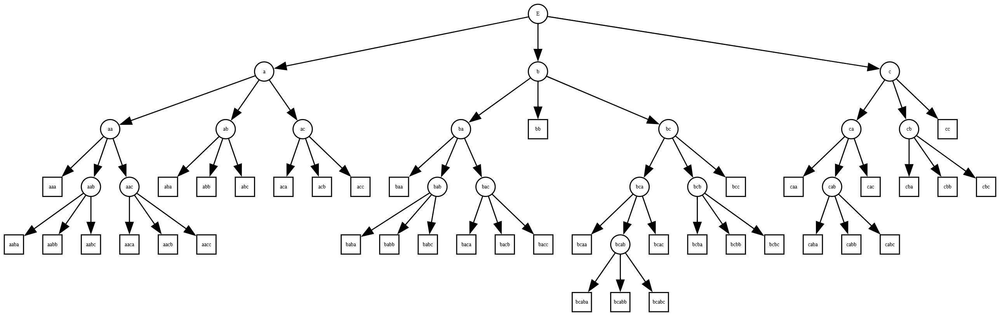

# Отчёт по lab1

## Задание

По имеющейся SRS требуется определить:

* Завершимость.
* Конечность классов эквивалентности по НФ
  (для эквивалентностей считаем, что правила применяются в обе стороны).
  Если классов конечное число — построить минимальную систему переписывания, им соответствующую.
* Локальную конфлюэнтность и пополняемость по Кнуту–Бендиксу.

---

## Исходная система правил (SRS)

```text
cc  -> aa
aaa -> aa
aaba -> ababaabcba
aacb -> aa
aabc -> aa
aba -> a
abc -> aa
aca -> abba
acb -> abb
baa -> aa
bb  -> aaaba
caa -> aa
cac -> ε
cba -> caca
cbc -> c
```

---

## 1) Завершимость

В исходной системе есть цикл. Следовательно, система не завершима:

```text
aaba → ababaabcba (aaba -> ababaabcba)
ababaabcba -> ababaaaba (abc -> aa)
```
В ababaaaba есть подстрока aaba с которой мы начали переписывание.

Чтобы сделать систему завершимой введём фундированный (милитари) порядок. Тогда:
```text
cc  -> aa
aaa -> aa
ababaabcba -> aaba
aacb -> aa
aabc -> aa
aba -> a
abc -> aa
abba -> aca
acb -> abb
baa -> aa
aaaba  -> bb
caa -> aa
cac -> ε
caca -> cba
cbc -> c
```

---

## 2) Конечность классов эквивалентности по НФ

Построим дерево:

В кружках НФ, в квадратах слова, к которым можно применить какое-либо правило.

## 3.1) Локальная конфлюэнтность и пополняемость (Кнут–Бендикс)
Локальная конфлюэнтность отсутствует.
Рассмотрим слово `acbc`:

```text
acbc -> aabb (acb -> abb)

acbc -> ac (cbc -> ac)
```

Первое преобразование ведёт в aabb, а второе в ac. К обоим результатам нельзя преминить ни одно правило. Поэтому локальная конфлюэнтность отсутствует.

Пополнение:
```text
ccc -> aac
ccc -> caa -> aa
Новое aаc  -> aa

caca -> cba
caca -> a
Новое cba -> a

aaaba -> bb
aaaba -> aaa -> aa
Новое bb -> aa

ccc -> aac
ccc -> caa -> aa
Новое aac -> aa

acbc -> ac
acbc -> abbc -> aaac -> aaa -> aa
Новое ac -> aa

cac -> ε
cac -> caa -> aa
Новое aa -> ε

aaa -> aa
aaa -> a
Новое aa -> a

aa -> ε
aa -> a
Новое a -> ε

ccac -> c
ccac -> aac -> aa -> a -> ε
Новое с -> ε

cacb -> b
cacb -> cabb -> caaa -> aaa -> aa -> a -> ε
Новое b -> ε
```

Получили правила a -> ε, b -> ε, c -> ε
Тогда минимальная SRS:
```text
a -> ε
b -> ε
c -> ε
````

---

## 3.2) Локальная конфлюэнтность и пополняемость (Кнут–Бендикс) (Без cac -> ε)


Пополнение:
```text
Можно удалить ababaabcba -> aaba
Так как: ababaabcba -> ababaaaba -> abaaaba -> aaaba -> aaba
(abc -> aa) (aba -> a) (aba -> a) (aaa -> aa)

Можно удалить aabc -> aa
Так как: aabc -> aaa -> aa
(aba -> aa) (aaa -> aa)

Заменить aacb -> aa на aabb -> aa
Так как: aacb -> aabb
(acb -> abb)

Заменить aaaba -> bb на aaa -> bb
Так как: aaaba -> aaa
(aba -> a)

aaa -> bb
aaa -> aa
Новое bb -> aa

Можно удалить aaa -> aa
Так как: aaa -> bb -> aa

Можно удалить aabb -> aa
Так как: aabb -> aaaa -> aaa -> aa

Заменить abba -> aca на bba -> aca
abba -> aaaa -> bba
(bb -> aa) (aaa -> bb)

ccc -> aac
ccc -> caa -> aa
Новое aac -> aa

acbc -> ac
acbc -> abbc -> aaac -> aaa -> aa
Новое ac -> aa

Можно удалить aac -> aa
aac -> aaa -> aa
(ac -> aa) (aaa -> bb -> aa)

Замена caca -> cba на cbb -> cba
caca -> caaa -> cbb
(ac -> aa) (aaa -> bb)

acb -> abb -> aaa -> bb -> aa
acb -> aab
Новое aab -> aa

cbb -> cba
cbb -> caa -> aa
Новое cba -> aa
```
Критических пар больше нет, система конфлюэнтна

Система после пополнения

```text
cc  -> aa
aba -> a
abc -> aa
bba -> aca
acb -> abb
baa -> aa
aaa  -> bb
caa -> aa
cbb -> cba
cbc -> c
bb -> aa
ac -> aa
aab -> aa
cba -> aa
```


## 4) Инварианты и тестирование

Так как изначальная система тривиальна, то инвариант придуман для системы без правила cac -> ε

Пусть A = [[0, 0], [0, 0]], B = [[0, 1], [0, 0]], C = [[0, 0], [1, 0]]. Если подставить в исходную систему эти матрицы вместо соответсвующих букв, по произведение матриц в левой и правой части будет равно.