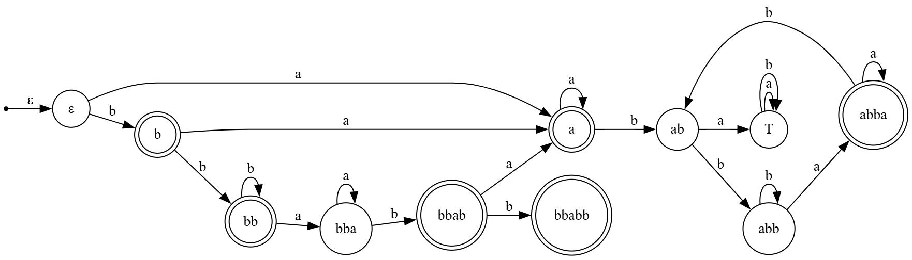
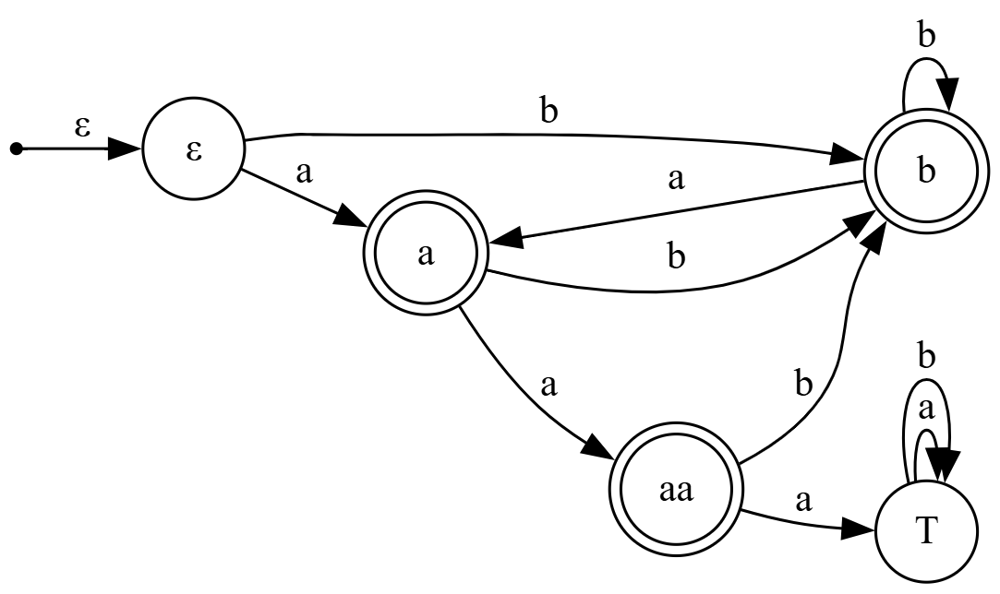
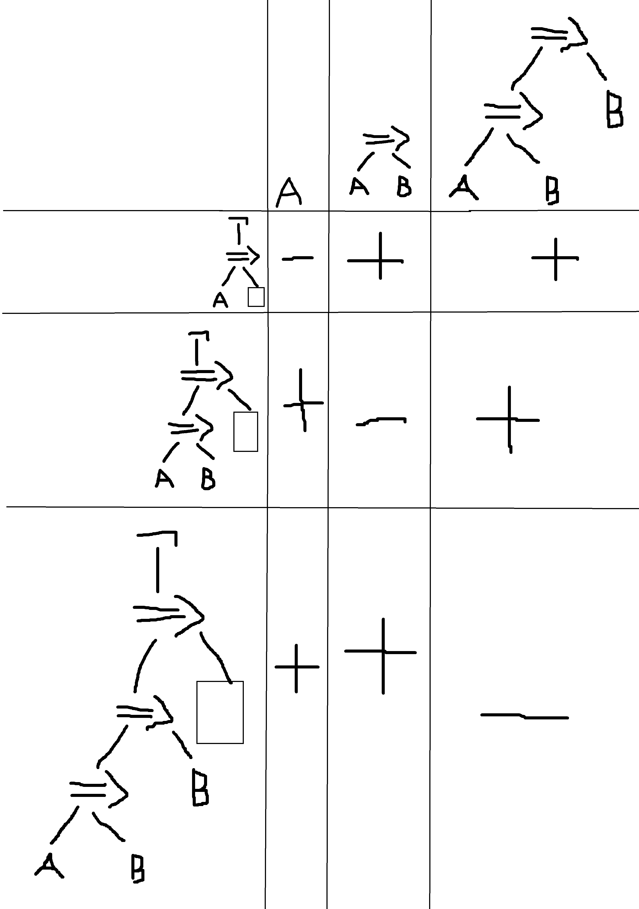
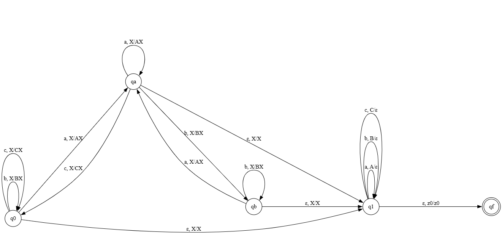

# РК1

## Задание

1 Язык { w₁aaaw₂ | |w₁|ab = |w₁|bba & |w₂|aaa = 0 & wᵢ ∈ {a,b}+ }.

2 Язык деревьев логических выражений с ⇒, ¬ и переменными A, B, не являющихся тождественным противоречием.

3 Язык таких палиндромов в {a,b,c}+, что в них нет подстрок, удовлетворяющих шаблону ab+c.

## 1

Регулярный, т. к. { w₁ | |w₁|ab = |w₁|bba & w₁ ∈ {a,b}+ } и { w₂ | |w₂|aaa = 0 & w₂ ∈ {a,b}+ } регулярные.

Автомат для w₁

 

Автомат для w₂

 

## 2
Нерегулярный, т. к. бесконечное число классов эквивалентности.

Таблица:

 

## 3

КС, нерегулярный

PDA

 

q0 - начальное состояние, нет a для шаблона ab+c

qa - последний символ был a

qb - после a  были b+

q1 - сравниваем 2 половину палиндрома с первой

qf - конец

Нерегулярность

Рассмотрим слово acⁿacⁿa

|acⁿacⁿa|=2n+3

xyz = acⁿacⁿa

Если x = ε, то y = acᵗ, t+1 <= n, z = cⁿ⁻ᵗacⁿa

Тогда xy²z=acᵗacᵗcⁿ⁻ᵗacⁿa => t=n, но t+1 <= n

Если x = acᵖ, то y = cʳ, r>0

1+p+r <= n

z = cⁿ⁻ᵖ⁻ʳacⁿa

xy²z= acᵖcʳcʳcⁿ⁻ᵖ⁻ʳacⁿa=acᵖ⁺ʳ⁺ʳ⁺ⁿ⁻ᵖ⁻ʳacⁿa=acⁿ⁺ʳacⁿa

n+r=n

r = 0, но r > 0

Значит язык нерегулярен.

