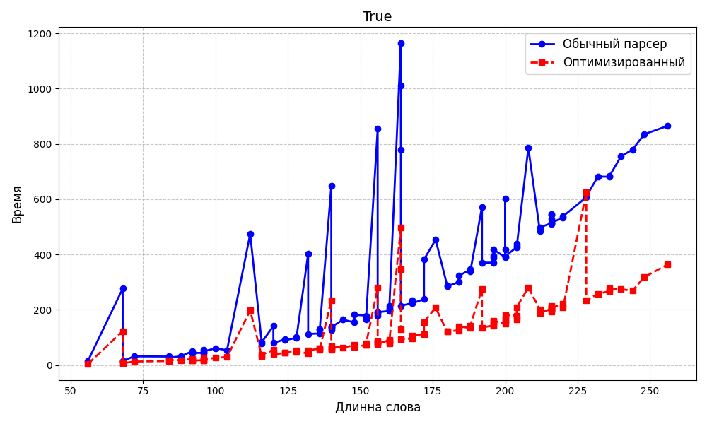
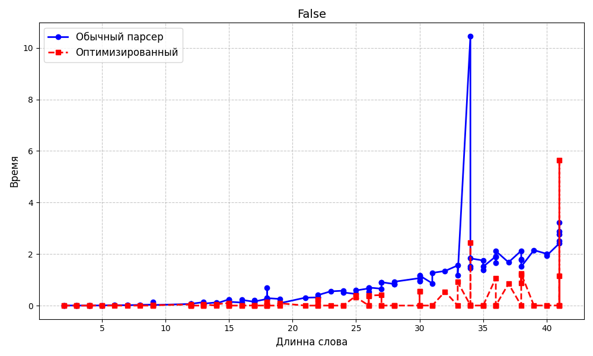

# Отчёт по lab4

## Задание
 Проанализировать язык на КС-свойство, в случае его наличия — на регу
лярность.

 Построить"наивный"парсер слов для языка, используя рекурсивный разбор
с возвратами. Парсер не должен зацикливаться.

 Построить оптимизированный парсер слов для языка. Оценить сверху его
вычислительную сложность.

 Посредствомфазз-тестирования проверить эквивалентность парсеров и по
строить сравнительные графики скорости их работы на случайных словах,
принадлежащих языку, и не принадлежащих языку (два тестовых пула).

---

## Вариант 5

```text
1)S →SabS S0.x:=0, если S1.x > S2.x, S2.x если  S1.x ⩽ S2.x,S2.x
2)S →TT T1.x == T2.x,S.x := T1.x + T2.x
3)S →aT S.x := T.x +1
4)T →SaT T0.x := S.x +T1.x +1
5)S →bb S.x := 0
6)T →ab T.x := 1


```

---

## 1)
Заметим, что если в T->SaT S всегда ракрывать по 2 правилу(S->aT), а T полученную из S по 4, то получим:

T->SaT->aTaT->aSaTaT->aaTaTaT-> .... -> a<sup>n</sup>T(aT)<sup>n</sup> -> a<sup>n</sup>ab(aab)<sup>n</sup>
При этом T.x = 3n+1


Рассмотрим слово полученное из  S->T<sub>1</sub>T<sub>2</sub>.
Раскроем  T<sub>1</sub> как T->SaT->bbaab. Тогда T<sub>1</sub>.x=2.
Чтобы слово принадлежало языку, у T<sub>2</sub> тоже атрибут тоже должен быть равен 2.
Также раскроем T<sub>2</sub> как T->S<sup>'</sup>aT->S<sup>'</sup>aab. Тогда 
T<sub>2</sub>.x=1+1+ S<sup>'</sup>.x. Получили, что S<sup>'</sup>.x дожно  равняться нулю. Если раскрыть S<sup>'</sup>.x->S<sup>''</sup>abS<sup>'''</sup>, то либо S<sup>''</sup> = S<sup>'''</sup> =bb, либо S<sup>''</sup>.x> S<sup>'''</sup>.x.
Раскроем S<sup>'''</sup> и S<sup>''</sup> c помощью S->aT:

S<sup>''</sup>->aT<sup>''</sup>
S<sup>'''</sup>->aT<sup>'''</sup>

T<sup>''</sup> и T<sup>'''</sup> раскроем как:

T<sup>''</sup> -> a<sup>n</sup>ab(aab)<sup>n</sup>
T<sup>'''</sup> -> a<sup>t</sup>ab(aab)<sup>t</sup>

Чтобы выполнялось условие S<sup>''</sup>.x> S<sup>'''</sup>.x необходимо, чтобы n>t.

Получили слово вида:

bbaabaa<sup>n</sup>ab(aab)<sup>n</sup>abaa<sup>t</sup>ab(aab)<sup>t</sup>aab, где n>t.

Рассмотрим разбор слов вида

 bbaabaa<sup>s</sup>ab(aab)<sup>d</sup>abaa<sup>f</sup>ab(aab)<sup>g</sup>aab, s>0,d>0, f>0, g>0.

Любой нетерминал заканчивается на b. Тогда если перед нетерминалом строит a, то она полученна либо из 3 либо из 4.


Если в слове встретилось aab, то оно полученно из S->aT->aab или T->SaT->Saab, то есть ab точно полученно из T->ab и первое a в aab принадлежит правилу, других способов нет.

Любое слово заканчивается либо на bb, и тогда последний нетерминал был S, либо на  ab, и тогда последний нетерминал был T.
Так как слово начинается на bb, то первый нетерминал был S. Получаем:

Saabaa<sup>s</sup>ab(aab)<sup>d</sup>abaa<sup>f</sup>ab(aab)<sup>g</sup>aT


В слове встречается aab, заменим их на aT:

SaTaa<sup>s</sup>T(aT)<sup>d</sup>abaa<sup>f</sup>T(aT)<sup>g</sup>aT


Два нетерминала S не могут стоять рядом, следовательно первое aT не может быть полученно из правила S->aT, а только из T->SaT. Заменим первое SaT на T:

Taa<sup>s</sup>T(aT)<sup>d</sup>abaa<sup>f</sup>T(aT)<sup>g</sup>aT

В слове не может стоять польше двух T рядом.

Слово начинается с нетерминала T только в том случае, если оно полученно из S->TT. При этом всё наше слово полученно из  S ->TT, так как вариант S->SabS->TTabT подразумевает, что второе T равно aa<sup>s</sup>T(aT)<sup>d</sup> и при d > 1  получаем T.val > 2. При d = 1 aa<sup>s</sup>T(aT)<sup>d</sup>=aa<sup>s</sup>TaT=a<sup>s</sup>SaT=a<sup>s</sup>T - такое возможно только при s=0. При d=0 aa<sup>s</sup>T - невозможно.

Значит первое было по правилу S->TT. T.x у первой T равен 2. Тогда T.x у второй T тоже должен быть равен 2. И вторая T равна:


aa<sup>s</sup>T(aT)<sup>d</sup>abaa<sup>f</sup>T(aT)<sup>g</sup>aT

Очевидно, что второе T раскрыли по правилу T->SaT. Так как S должно закончиться на b, то как минимум первые a принадлежат этому S.

T заканчивается на TaT, такую комбинацию можно получить только из T->SaT->TTaT или T->SaT-aTaT или T->SaT->SabSaT->(SabaTaT или SabSaTaT).
Тогда последнее aT полученно из T->SaT, а вся остальная чать T - это S, причем S.x = 0, иначе слово не будет принадлежать языку. Это S сожержит T, значит его атрибут может занулиться только если оно раскрыто как S->SabS, причем S1.x>S2.x. В слове осталось только одно ab, поэтому S1 и S2 определяются однозначно:

S1: aa<sup>s</sup>T(aT)<sup>d</sup>

S2: aa<sup>f</sup>T(aT)<sup>g</sup>


Теперь разберем слова вида aa<sup>p</sup>T(aT)<sup>w</sup>:

Первая T полученна из правила S->aT. Из других правил получить нельзя, так как перед первой T нет ни одной буквы b, а значит все эти ашки полученны из последовательного применения правил S->aT->aSaT->...

Заменим:
aa<sup>p-1</sup>S(aT)<sup>w</sup>

Так как в слове нет b, то эта S могла быть полученна только из T->SaT. Заменим:
aa<sup>p-1</sup>T(aT)<sup>w-1</sup>

Значит aa<sup>p</sup>T(aT)<sup>w</sup> полученно из aa<sup>p-1</sup>T(aT)<sup>w-1</sup>

Продолжая преобразования, получим один из 3х исходов, в зависимости от соотношение p и w.

1) w=p

В этом случае продолжая преобразования получим, что

 aa<sup>p</sup>T(aT)<sup>w</sup>  получилось из aT, которое могло быть полученно только из S->aT. Значит такое слово есть в языке. Этот разбор совпадает с предложенным выше, n>t.

 2) p > w:
В этом случае продолжая преобразования получим, что

 aa<sup>p</sup>T(aT)<sup>w</sup>  получилось из  aa<sup>p-w</sup>T.

 Тогда в aa<sup>p-w</sup>T=a<sup>p-w+1</sup>T последнее T полученно из S->aT. Заменим: a<sup>p-w</sup>S,

 получить в начале слова много ашек перед S можно только используя:
 s->aT->aSaT, но тогда в слове после S должны быть ещё буквы. Значит такое слово не принадлежит языку.

 3) p < w - такое возможно, но при доказательстве, что язык не кс мы это аккуратно обойдём


 Вообщем p<=w


 Пересечём наш язык с регуляркой 
 
bbaabaa<sup>+</sup>ab(aab)<sup>+</sup>abaa<sup>+</sup>ab(aab)<sup>+</sup>aab
 
Тогда получим язык:
bbaabaa<sup>s</sup>ab(aab)<sup>d</sup>abaa<sup>f</sup>ab(aab)<sup>g</sup>aab, s<=d, f<=g, и в случае если s=d и f=g должно выполниться s=d>f=g
 
Тогда для каждого n рассмотрим слово
 
q=bbaabaa<sup>n+1</sup>ab(aab)<sup>n+1</sup>abaa<sup>n</sup>ab(aab)<sup>n</sup>aab,
n+1>n - слово принадлежит языку.
 
Качать можно только блоки со степенью, так как иначе слово не будут удовлетворять регулярке. 

uvxyz=q

Если v или y пустно:
1) Если качаемый блок находится в a<sup>n+1</sup>, то накачка вверж рушит условие s<=d.
2) Если качаемый блок находится в (aab)<sup>n+1</sup>, то накачка вниз рушит условие s<=d.
3) Если качаемый блок находится в a<sup>n</sup>, то накачка вверж рушит условие f<=g.
4) Если качаемый блок находится в (aab)<sup>n</sup>, то накачка вниз рушит условие f<=g.


Если и v и y не пусто:

Если v в a<sup>n+1</sup>, а y в (aab)<sup>n+1</sup>

Пусть количество букв в y равно 3r, а количестко букв в v равно m. Тогда:

 1) если r=m, то отрицательная накачка ломает условие s=d>f=g.
 2) если r>m, то отрицательная накачка ломает условие s<=d.
 3) если r<m, то любая положительная накачка ломает условие s =< d.


Если v в a<sup>n</sup>, а y в (aab)<sup>n</sup>

Пусть количество букв в y равно 3r, а количестко букв в v равно m. Тогда:

1) если r=m, то отрицательная накачка ломает условие s=d>f=g
2) если r>m, то отрицательная накачка ломает условие f<=g
3) если r<m, то любая положительная накачка ломает условие f<=g
Вывод: язык не кс


Если v в (aab)<sup>n+1</sup>, а y в a<sup>n</sup>

Любая накачка рушит одно из условий: s<=d или f<=g
Вывод: язык не кс


Инварианты для оптимизированного парсера:
1) Слово всегда заканчивается на b
2) Любой нетерминал и слово не может начинатся с ba


График для слов, которые принадлежат языку:


График для слов, которые не принадлежат языку:



Оптимизированный парсер работает за O(n^5)


