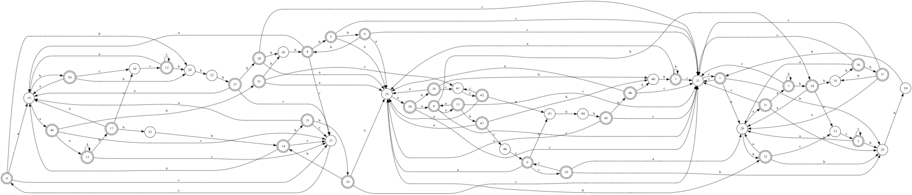
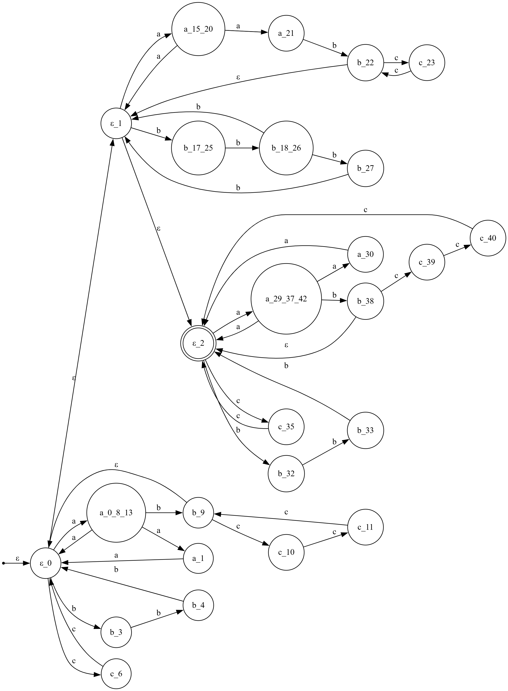
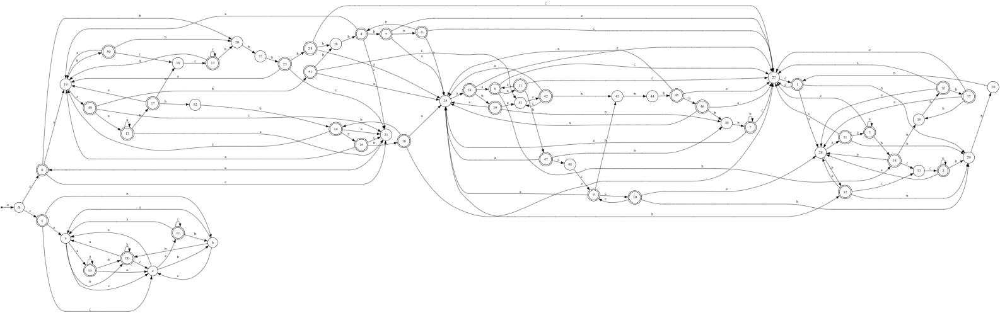

# Отчёт по lab2

## Задание
По имеющемуся академическому регулярному выражению построить:

 * минимальный ДКА, распознающий его язык (минимальность обосновать
 таблицей классов эквивалентности)
 * возможно малый НКА, распознающий его язык. Возможно малый переклю
чающийся (с конъюнкцией) КА, распознающий его язык. Частично обосно
вать таблицами множеств классов эквивалентности.
 * расширенное регулярное выражение, распознающее тот же язык. В расширенном выражении можно использовать: 
  1. wildcard-операцию `.` для замены произвольного символа алфавита;
  2. положительную итерацию `τ+` и опцию `τ?`. `τ+ = ττ∗`, `τ? = (τ|ε)`;
  3. операции предпросмотра `τ0(?= τ1)τ2 ≡ τ0((τ1.∗) ∩ τ2)` и ретроспективной проверки `τ0(?<= τ1)τ2 ≡ (τ0 ∩ (τ1.∗))τ2`, а также их отрицательные версии `τ0(?! τ1)τ2 ≡ τ0( (τ1.∗) ∩ τ2)` и `τ0(?<! τ1)τ2 ≡ (τ0 ∩ (τ1.∗))τ2`;
  4. классы букв `[c1 ...ck] ≡ (c1|c2|...|ck)` и их дополнения `[ˆc1 ...ck]`;
  5. (обязательно) маркеры начала и конца выражения `ˆ` и `$`.

---

## Вариант 5

```text
(aaa | bbb | cc | ab(ccc)∗ | aa)∗(aa | bbb | aab(cc)∗ | bbbb)∗(aaa |
 bbb | cc | ab(ccc)∗ | aa)∗
```

---

## 1) ДКА

 

0 - Начальное состояние

Таблица классов эквивалентности
| state | prefix/suffix | ε | a | b | c | ab | bb | cc | aab | bbb | ccc | baab | bccc | caab | abaab | ccaab | babaab | cabaab | bbabaab |
|:-----:|:-------------:|:-:|:-:|:-:|:-:|:--:|:--:|:--:|:---:|:---:|:---:|:----:|:----:|:----:|:-----:|:-----:|:------:|:------:|:-------:|
| 0 | ε | 1 | 0 | 0 | 0 | 1 | 0 | 1 | 1 | 1 | 0 | 0 | 0 | 0 | 1 | 1 | 0 | 0 | 0 |
| 1 | bbbbcc | 1 | 0 | 0 | 0 | 1 | 0 | 1 | 0 | 1 | 0 | 0 | 0 | 0 | 0 | 0 | 0 | 0 | 0 |
| 2 | aababcc | 1 | 0 | 0 | 1 | 1 | 0 | 1 | 0 | 1 | 1 | 0 | 0 | 0 | 0 | 0 | 0 | 0 | 0 |
| 3 | aababaaa | 1 | 1 | 1 | 0 | 1 | 0 | 1 | 1 | 1 | 0 | 0 | 1 | 0 | 0 | 0 | 0 | 0 | 0 |
| 4 | aabbb | 1 | 0 | 1 | 0 | 1 | 1 | 1 | 1 | 1 | 0 | 1 | 0 | 0 | 1 | 1 | 0 | 0 | 0 |
| 5 | aabbbb | 1 | 0 | 1 | 0 | 1 | 1 | 1 | 1 | 1 | 0 | 1 | 0 | 0 | 0 | 0 | 0 | 0 | 1 |
| 6 | aabbbbb | 1 | 0 | 1 | 0 | 1 | 1 | 1 | 1 | 1 | 0 | 1 | 0 | 0 | 0 | 0 | 1 | 0 | 0 |
| 7 | aabaabbb | 1 | 0 | 1 | 0 | 1 | 1 | 1 | 1 | 1 | 0 | 1 | 0 | 0 | 0 | 0 | 0 | 0 | 0 |
| 8 | aabaaa | 1 | 1 | 1 | 0 | 1 | 0 | 1 | 1 | 1 | 0 | 1 | 1 | 0 | 1 | 0 | 0 | 0 | 0 |
| 9 | aabaaaabcc | 1 | 0 | 0 | 1 | 1 | 0 | 1 | 1 | 1 | 1 | 0 | 0 | 0 | 0 | 1 | 0 | 0 | 0 |
| 10 | aabaaaabccc | 1 | 0 | 0 | 1 | 1 | 0 | 1 | 0 | 1 | 1 | 0 | 0 | 1 | 0 | 0 | 0 | 0 | 0 |
| 11 | aabaaaa | 1 | 1 | 1 | 0 | 1 | 0 | 1 | 1 | 1 | 0 | 1 | 1 | 0 | 0 | 0 | 0 | 0 | 0 |
| 12 | abcc | 1 | 0 | 0 | 1 | 1 | 0 | 1 | 1 | 1 | 1 | 0 | 0 | 1 | 1 | 1 | 0 | 1 | 0 |
| 13 | aaa | 1 | 1 | 1 | 0 | 1 | 0 | 1 | 1 | 1 | 0 | 1 | 1 | 0 | 1 | 1 | 1 | 0 | 0 |
| 14 | aaabbb | 1 | 0 | 1 | 0 | 1 | 1 | 1 | 1 | 1 | 0 | 1 | 0 | 0 | 1 | 1 | 1 | 0 | 0 |
| 15 | aaabbbb | 1 | 0 | 1 | 0 | 1 | 1 | 1 | 1 | 1 | 0 | 1 | 0 | 0 | 1 | 1 | 0 | 0 | 1 |
| 16 | aaabbbbb | 1 | 0 | 1 | 0 | 1 | 1 | 1 | 1 | 1 | 0 | 1 | 0 | 0 | 0 | 0 | 1 | 0 | 1 |
| 17 | aaab | 1 | 0 | 0 | 0 | 1 | 1 | 1 | 1 | 1 | 1 | 0 | 0 | 0 | 1 | 1 | 0 | 0 | 1 |
| 18 | abc | 0 | 0 | 0 | 1 | 0 | 0 | 1 | 0 | 0 | 1 | 0 | 0 | 1 | 0 | 1 | 0 | 1 | 0 |
| 19 | a | 0 | 1 | 1 | 0 | 1 | 0 | 0 | 1 | 0 | 0 | 1 | 1 | 0 | 1 | 0 | 1 | 0 | 0 |
| 20 | b | 0 | 0 | 0 | 0 | 0 | 1 | 0 | 0 | 1 | 0 | 0 | 0 | 0 | 0 | 0 | 0 | 0 | 1 |
| 21 | c | 0 | 0 | 0 | 1 | 0 | 0 | 0 | 0 | 0 | 1 | 0 | 0 | 1 | 0 | 0 | 0 | 1 | 0 |
| 22 | bb | 0 | 0 | 1 | 0 | 0 | 1 | 0 | 0 | 0 | 0 | 1 | 0 | 0 | 0 | 0 | 1 | 0 | 0 |
| 23 | bbb | 1 | 0 | 1 | 0 | 1 | 0 | 1 | 1 | 1 | 0 | 1 | 0 | 0 | 1 | 1 | 0 | 0 | 0 |
| 24 | bbbb | 1 | 0 | 0 | 0 | 1 | 1 | 1 | 1 | 1 | 0 | 0 | 0 | 0 | 0 | 0 | 0 | 0 | 1 |
| 25 | aaba | 0 | 1 | 1 | 0 | 1 | 0 | 0 | 1 | 0 | 0 | 0 | 1 | 0 | 1 | 0 | 0 | 0 | 0 |
| 26 | aabb | 0 | 0 | 1 | 0 | 0 | 1 | 0 | 0 | 1 | 0 | 1 | 0 | 0 | 0 | 0 | 1 | 0 | 0 |
| 27 | bbbbc | 0 | 0 | 0 | 1 | 0 | 0 | 0 | 0 | 0 | 1 | 0 | 0 | 0 | 0 | 0 | 0 | 0 | 0 |
| 28 | aababa | 0 | 1 | 1 | 0 | 0 | 0 | 0 | 1 | 0 | 0 | 0 | 1 | 0 | 0 | 0 | 0 | 0 | 0 |
| 29 | aababb | 0 | 0 | 0 | 0 | 0 | 1 | 0 | 0 | 0 | 0 | 0 | 0 | 0 | 0 | 0 | 0 | 0 | 0 |
| 30 | aababbb | 0 | 0 | 1 | 0 | 0 | 0 | 0 | 0 | 0 | 0 | 0 | 0 | 0 | 0 | 0 | 0 | 0 | 0 |
| 31 | aababaa | 1 | 1 | 0 | 0 | 1 | 0 | 1 | 1 | 1 | 0 | 0 | 0 | 0 | 0 | 0 | 0 | 0 | 0 |
| 32 | aabab | 1 | 0 | 0 | 0 | 1 | 0 | 1 | 0 | 1 | 1 | 0 | 0 | 0 | 0 | 0 | 0 | 0 | 0 |
| 33 | aababc | 0 | 0 | 0 | 1 | 0 | 0 | 1 | 0 | 0 | 1 | 0 | 0 | 0 | 0 | 0 | 0 | 0 | 0 |
| 34 | aabaaab | 1 | 0 | 0 | 0 | 1 | 1 | 1 | 0 | 1 | 1 | 0 | 0 | 0 | 0 | 0 | 0 | 0 | 0 |
| 35 | aabaaabb | 0 | 0 | 1 | 0 | 0 | 1 | 0 | 0 | 0 | 0 | 0 | 0 | 0 | 0 | 0 | 0 | 0 | 0 |
| 36 | aabaaabbb | 1 | 0 | 1 | 0 | 1 | 0 | 1 | 0 | 1 | 0 | 0 | 0 | 0 | 0 | 0 | 0 | 0 | 0 |
| 37 | aabaaabbbb | 1 | 0 | 0 | 0 | 1 | 1 | 1 | 0 | 1 | 0 | 0 | 0 | 0 | 0 | 0 | 0 | 0 | 0 |
| 38 | aabaa | 1 | 1 | 1 | 0 | 1 | 0 | 1 | 1 | 1 | 0 | 1 | 0 | 0 | 0 | 0 | 0 | 0 | 0 |
| 39 | aabaab | 1 | 0 | 0 | 0 | 1 | 1 | 1 | 1 | 1 | 0 | 0 | 0 | 0 | 0 | 1 | 0 | 0 | 0 |
| 40 | aabaabb | 0 | 0 | 1 | 0 | 0 | 1 | 0 | 0 | 1 | 0 | 1 | 0 | 0 | 0 | 0 | 0 | 0 | 0 |
| 41 | aabc | 0 | 0 | 0 | 1 | 0 | 0 | 0 | 0 | 0 | 1 | 0 | 0 | 1 | 0 | 0 | 0 | 0 | 0 |
| 42 | aabcc | 1 | 0 | 0 | 0 | 1 | 0 | 1 | 1 | 1 | 0 | 0 | 0 | 0 | 0 | 1 | 0 | 0 | 0 |
| 43 | aabccb | 0 | 0 | 0 | 0 | 0 | 1 | 0 | 0 | 1 | 0 | 0 | 0 | 0 | 0 | 0 | 0 | 0 | 0 |
| 44 | aabccbb | 0 | 0 | 1 | 0 | 0 | 1 | 0 | 0 | 0 | 0 | 1 | 0 | 0 | 0 | 0 | 0 | 0 | 0 |
| 45 | aabccbbb | 1 | 0 | 1 | 0 | 1 | 0 | 1 | 1 | 1 | 0 | 1 | 0 | 0 | 0 | 0 | 0 | 0 | 0 |
| 46 | aabccbbbb | 1 | 0 | 0 | 0 | 1 | 1 | 1 | 1 | 1 | 0 | 0 | 0 | 0 | 0 | 0 | 0 | 0 | 0 |
| 47 | aabaaaab | 1 | 0 | 0 | 0 | 1 | 1 | 1 | 1 | 1 | 1 | 0 | 0 | 0 | 0 | 1 | 0 | 0 | 0 |
| 48 | aabaaaabc | 0 | 0 | 0 | 1 | 0 | 0 | 1 | 0 | 0 | 1 | 0 | 0 | 1 | 0 | 0 | 0 | 0 | 0 |
| 49 | aa | 1 | 1 | 1 | 0 | 1 | 0 | 1 | 1 | 1 | 0 | 1 | 0 | 0 | 1 | 1 | 0 | 0 | 0 |
| 50 | ab | 1 | 0 | 0 | 0 | 1 | 0 | 1 | 1 | 1 | 1 | 0 | 0 | 0 | 1 | 1 | 0 | 0 | 0 |
| 51 | aab | 1 | 0 | 0 | 0 | 1 | 1 | 1 | 1 | 1 | 0 | 0 | 0 | 0 | 0 | 1 | 0 | 0 | 1 |
| 52 | aaabb | 0 | 0 | 1 | 0 | 0 | 1 | 0 | 0 | 1 | 0 | 1 | 0 | 0 | 0 | 0 | 1 | 0 | 1 |

## 2) НКА

На основе академического регулярного выражения с использованием линеаризации был построен НКА.


 

| prefix/suffix | c | abaab | bccc | cc | bbabaab | babaab | bbb | baab | bb | b |
| :--- | :---: | :---: | :---: | :---: | :---: | :---: | :---: | :---: | :---: | :---: |
| aabaaaabccc | 1| 0| 0| 1| 0| 0| 1| 0| 0| 0|
| aabbb | 0| 1| 0| 1| 0| 0| 1| 1| 1| 1|
| aababaaa | 0| 0| 1| 1| 0| 0| 1| 0| 0| 1|
| bbbb | 0| 0| 0| 1| 1| 0| 0| 0| 1| 1|
| aaabb | 0| 0| 0| 0| 1| 1| 1| 1| 1| 1|
| aabb | 0| 0| 0| 0| 0| 1| 1| 1| 1| 1|
| aabaabb | 0| 0| 0| 0| 0| 0| 1| 1| 1| 1|
|  aabccbb| 0| 0| 0| 0| 0| 0| 0| 1| 1| 1|
| aabaaabb | 0| 0| 0| 0| 0| 0| 0| 0| 1| 1|
| aababbb | 0| 0| 0| 0| 0| 0| 0| 0| 0| 1|

## 3) ПКА

Заметим, что слово либо является ε, либо заканчивается на aa, bb, cc, ab.


 

| prefix/suffix |cabaab| c | abaab | bccc | cc | bbabaab | babaab | bbb | baab | bb | 
| :--- | :---: |:---: | :---: | :---: | :---: | :---: | :---: | :---: | :---: | :---: | 
| bbbbc|0| 1| 0| 0| 1| 0| 0| 0| 0| 0| 
| aabbb| 0| 0| 1| 0| 1| 0| 0| 1| 1| 1| 
| aababaaa |0| 0| 0| 1| 1| 0| 0| 1| 0| 0| 
| bbbb | 0|0| 0| 0| 1| 1| 0| 0| 0| 1| 
| aaabb |0 |0| 0| 0| 0| 1| 1| 1| 1| 1| 
| aabb | 0|0| 0| 0| 0| 0| 1| 1| 1| 1| 
| aabaabb |0| 0| 0| 0| 0| 0| 0| 1| 1| 1| 
|  aabccbb| 0|0| 0| 0| 0| 0| 0| 0| 1| 1| 
| aabaaabb | 0|0| 0| 0| 0| 0| 0| 0| 0| 1| 
| aababbb | 0|0| 0| 0| 0| 0| 0| 0| 0| 0| 


## 4) Расширенное регулярное выражение
Исходное выражение можно записать как X\*Y\*X\*, где 
X = (aaa | bbb | cc | ab(ccc)* | aa)
Y = (aa | bbb | aab(cc)∗ | bbbb)


aaa|aa=aaa? - Данный язык состоит из любого числа a, кроме одного.

Вместо aa можно взять aaa, если после aaa не ac. Так как в регулярке нет варианта, содержашего только одну a.
Аналогично, aa можно выбирать если после не ac.

Тогда aaa?=(aaa(?!ac)|aa(?!ac))

bbb|bbbb=bbbb?

aa|aab(cc)\*=aa(b(cc)\*)?


Расширенное регулярное выражение:
(aaa(?!ac)|aa(?!ac)|bbb|cc|ab(ccc)\*)\*(aa|bbb|aab(cc)\*|bbbb?)\*(aaa(?!ac)|aa(?!ac)|bbb|cc|ab(ccc)\*)\*


Т. к. выполнялись только эквивалентные преобразования, полученное регулярное выражение эквивалентно исходному.


