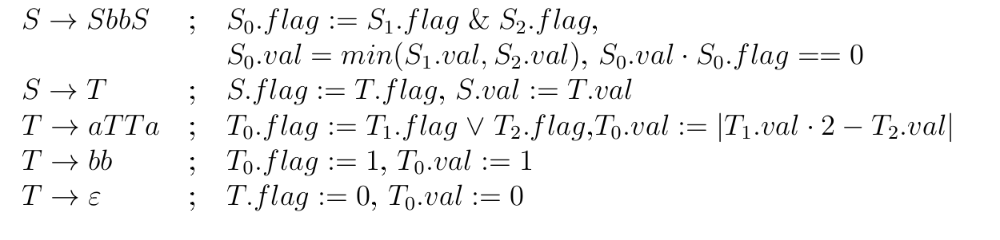

# РК2
 
## Задание
 
1 Язык SRS a →ba, bb →ab, ba → ab на базисе anbnan
 
## 1
 
Пронумеруем правила:
1) a →ba
2) bb →ab
3) ba → ab

 
Правила 1 и 3 позволяют приписывать с обоих сторон от a букву b.
То есть a->ba->ab
 
4) a->ab
 
Заметим, что:
 
1)Число букв а не убывает. 
 
2) В слове всегда есть хотя бы одна буква b и 2 буквы a.
 
3)Буквы b могут смещаться только вправо (правило 3). Поэтому если мы захотим получить букву b в слове раньше, то нам придёться воспользоваться 1 правилом.
 
4)Число букв a после последнего вхождения b не больше, чем n (то есть слово заканчивается не более чем на n букв a), так как правило 3 смешает буквы а влево, а появление новой a возможно только при применении правила 2, но оно справа от новой a оставляет b, которую можно двигать только вправо. Соответсвенно, всевозможные слова, которые можно получить из базы anbnan содержат не более an после последнего вхождения b.
 
5)Из anbnan применяя 4 правило, а потом 2 можно получить:
 
anbnan -> anbbnan ->
anabbn-1an -> an+1bnan
 
6)Из anbnan применяя 4 правило, можно получить:
 
anbnan -> anbbnan ->
anbn+1an 
 
7) Число букв a слева от последнего вхождения  b больше или равно количеству букв a справа от последнего вхождения b. Изначально справо и слева  от последнего b букв a поровну. По 4 пункту правый блок ашек может только убывать. 
 
8) Если слово заканчивается на k букв a, то длинна всего слова не менее 3*k, так как для того, чтобы слово заканчивалось на k букв а число n в базе anbnan должно быть равно минимум k. Тогда длинна слова минимум  3k, так как ни одно из правил не уменьшает длинну слов.
 
 
Докажем, что язык не КС, используя лемму о накачке для КС языков.
 
Пересечем наш язык L с регуляркой (ba)*b+a+.
 
Получим язык B, состоящий из (ba)sbat, где:
 
1) Если s = 0, остануться слова вида bat, по пункту  7 такое слово не принадлежит L, а значит и  B.  Просто b тоже не входит в L, а значит и в B по 2 пункту. Получили, что:
 
 s>0
 
 2) По пункту 7: s>= t.
 
 3) t >0, иначе слова не будут соответствовать регулярке.
 
Cлово для накачки:

 
1) К anbnan применим правило 1 n раз, получим:
 
bnanbnan
 
2) Применяя 3 правило, получим:
 
(ba)nbnan
 
Заметим, что чтобы уменьшить количество b в среднем блоке необходимо воспользоваться 2 правилом. И чтобы убрать лишнюю a блок (ba)* нужно воспользоваться 1 правилом:
 
(ba)nbnan-> (ba)nbbbn-2an -> (ba)nabbn-2an -> (ba)nbabbn-2an -> (ba)n+1bn-1an
 
Также рассмотрим:
 
(ba)n+1bn+1an+1-> (ba)n+1bbbn-1an+1 -> (ba)n+1abbn-1an+1 -> (ba)n+1babbn-1an+1 -> (ba)n+2bnan+1->(ba)n+2abnan->(ba)n+2babnan->(ba)n+3bnan
 
То есть в словах, удовлетворяющих регулярке (ba)*b+a+ c k буквами a на конце длинна слова минимум 4k (!!!)
 
Для любого p=n>0 будем рассматривать слово w = (ba)nbnan.
 
|w|=2n+n+n=4n>p
 
x1y1zy2x2 = (ba)nbnan
 
1) Если |x1|=0, то блок y1zy2 лежит целиком в (ba)n, тк |(ba)n| = 2n.
 
1.1) Если |z|=0, то накачивая yi: y10y20. Тогда либо первой буквой слова будет не b и тогда слово не будет соответсвовать шаблону регулярки, либо количество букв a слева  от последней b в слове будет меньше, чем справо, и слово опять не будет принадлежать L, а значит и B.
 
1.2) Если |z|!=0 и |y1| != 0, то как в 1.1
 
1.3) Если |z|!=0 и |y1| = 0,  |y2| != 0.
Если |y2| чётно, то  y20 уменьшит количество a справа от последней b и слово не будет принадлежать языку. А нечётно, то слово не будет удовлетворять регулярному выражению.
 
2) |x1|!=0 и блок y1zy2 лежит целиком в bn. Тогда y10zy20 уменьшает количество букв b и длинна слова становиться меньше 4n, согласно (!!!) такого быть не может, так как наше слово заканчивается на an.
 
3) |x1|!=0 и блок y1zy2 лежит  на стыке (ba)n и  bn. Тогда y10zy20 если |y2|!=0,  уменьшает количество букв b в bn и длинна слова становиться меньше 4n, согласно (!!!) такого быть не может, так как наше слово заканчивается на an. Либо если |y2|=0,  уменьшается количество букв a в (ba)n и слово не принадлежит языку, так как в an их не изменилось.
 
4) Если блок y1zy2 лежит  в an. Тогда y12zy22 увеличивает количество букв a после последней b, тогда слово не принадлежит языку.
 
5) Если блок y1zy2 лежит на стыке  bn и an. Тогда y12zy22, если |y2|!=0, то как в пункте выше. Иначе, если |y2|=0 и y1 целиком в bn, то y10zy20 как в 3 пункте.
И если  |y2|=0 и y1 лежит на стыке bn и an, то y12zy22 увеличивает количество a в конце. Тогда слово не принадлежит языку.
 
Вывод: язык не КС

## Задание
 
2. Язык {anu1bu2 | ui ∈ {a, b}+ & |u1|a < |u2|a < n}
 
## 2

1) Рассмотрим пересеченье L с регулярным языком R = a\*ba\*ba\*.
Получим язык:

L'={a^(x)ba^(p)ba^(q)}.

Докажем, что L' не является  КС-языком с помощью леммы о накачке для КС-языков. 
Пусть N - константа накачки. Выберем слово:

S=a^(N+2)ba^(N)ba^(N+1)

u2 содержит минимум N+1 букв a, поэтому n должно быть минимум N+2.
Тогда u1 равно ba^(N)

Для любого разбиения S=uvxyz найдётся накачка, выводящая слово из L'.

Если в блок, который качаем попадает b, но нулевая накачка этого блока выведет слово из языка, так как в слове должно быть минимум 2 буквы b.

1) Если vxy лежит в a^(N+2), то нулевая накачка ломает условие |u2|a < n.

2) Если vxy лежит в a^(N), то  накачка с i=2 ломает условие |u1|a  < n

3) Если vxy лежит в a^(N+1), то накачка с i=2 ломает условие |u2|a < n.

4) Если vxy пересекает границы групп, то любая накачка выведет слово из языка, так как сломаеться хотя бы одно из условий: |u1|a < |u2|a < n

Вывод: язык не кс.

## Задание 3

Заметим, что:

1) Cлово всегда содержит чётное число букв a и b.

2) Если слово получено по правилу S->SbbS, то справа и слева от bb может быть только по чётному числу букв a.

Пересечем наш язык с регулярным выражением:

a+bbbba(bba)+

Для любого n рассмотрим слово:

w=a2n+1bbbba(bba)2n

Такое слово можно получить с помощью правила S->T->aTTa

В aTTa вторую T раскроем как bb, а первую снова по правилу T->aTTa. Потом опять раскроем вторую T как bb, а первую снова по правилу T->aTTa. И так далее, в последнем T->aTTa обе T раскроем как bb.

Так как слово порождено без правила S->SbbS, оно принадлежит языку.

Слово такого вида можно получить только таким образом. Докажем это:

(!!!):
Так как в первый блок ашек нечетный, то следующий за ним bb не мог быть получен из правила S->SbbS. И следующий bb тоже. Значит bbbb в слове получено из T->aTTa, где оба T раскрыли как bb. Тогда слово выглядит так:

a2nT(bba)2n

Если следующее bb получено из правила S->SbbS, то первое S=a2nT, но никакие правила не позволяют получить такое раскрытие, значит следующее bb тоже получено из T->aTTa, где одна из T раскрыта как bb. 

2 T стоят рядом только в правиле T->aTTa. Тогда в нашем слове:

T->aTTa->aTbba 

Заменим aTbba на T. Получим:
a2n-1T(bba)2n-1

Продолжая рассуждение также, получим, что слова такого вида можно получить только таким способом.

Для доказательства нерегулярности языка качать можно либо блок a2n+1 либо (bba)2n.

Любая положительная накачка в a2n+1 выводит слово из языка.
Любая нулевая накачка в (bba)2n выводи слово из языка.

Значит язык не регулярный.

Заметим, что любое S с S.flag=1 и S.val>2 можно разобрать другим деревом разбора так, что S.val будет меньше 3.

Тогда язык задается следующей грамматикой(подразумевается, что T0.val=0, T1.val =1, T2.val=2), S' - стартовый нетерминал:

S'->T

B-> bbB|ε

A-> aaA|ε

T->aTTa

T->bb

T->ε

S->T

S->SbbS

S' -> SbbBA

S' -> ABbbS

S' -> SbbBABbbS

S' -> SbbT0

S' -> T0bbS

S' -> SbbBT0BbbS

T0->A

T0->aT0T0a

T0->aAT0a

T0->aT1T2a

T1 -> bb

T1->aT1T1a

T1->aT0T1a

T1->aT1a

T2-> aT1a

T2->aT1T0a

T2 -> aT2T2a

T2 -> aT0T2a

T2 -> aT2a

T2 -> aT1aaT1aaa

Ответ: КС, нерегулярный

